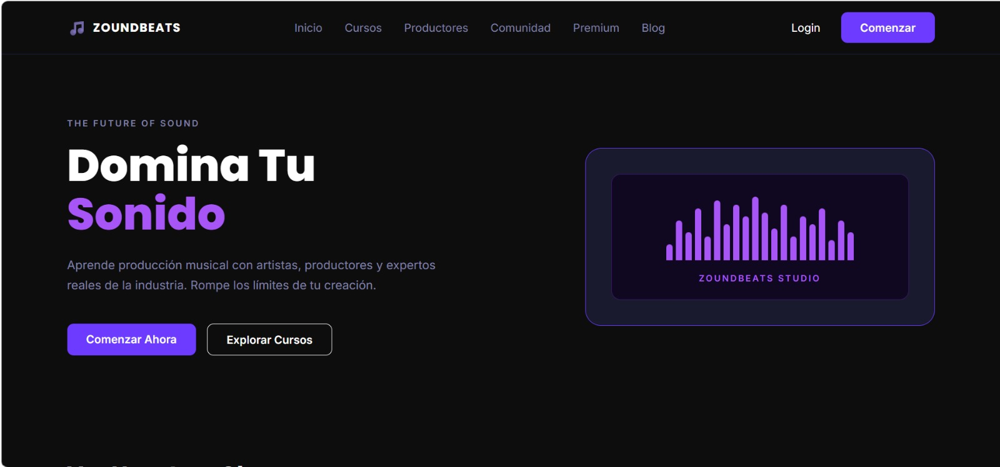

# ZoundBeats - Landing Page

## Descripción del proyecto

ZoundBeats es una plataforma digital enfocada en el aprendizaje de producción musical para estudiantes, músicos y creadores de contenido. Su objetivo es brindar una experiencia de aprendizaje práctica e interactiva mediante cursos especializados, mentorías con productores reconocidos, clases en vivo y una comunidad donde los usuarios puedan desarrollar sus habilidades musicales.

Este repositorio contiene el desarrollo de la **Landing Page** del proyecto, implementada como parte del curso utilizando únicamente **HTML** y **CSS**, siguiendo la metodología de trabajo **GitFlow** y buenas prácticas de desarrollo colaborativo.

---

## Segmentos Objetivo

La plataforma está dirigida principalmente a:

- Personas que desean iniciarse en la producción musical.
- Productores musicales principiantes e intermedios.
- Músicos y compositores emergentes.
- Creadores de contenido interesados en aprender producción musical.
- Usuarios de Latinoamérica que buscan una plataforma accesible y especializada.

---

## Características principales

La Landing Page presenta la información principal de la plataforma mediante las siguientes secciones:

- Barra de navegación intuitiva.
- Hero Section con presentación de la plataforma.
- Sección de clases destacadas.
- Tipos de cursos disponibles.
- Estadísticas de la comunidad.
- Banner promocional de workshops.
- Noticias y artículos del blog.
- Testimonios de estudiantes.
- Presentación de mentores especializados.
- Footer con enlaces e información de contacto.

---

## Tecnologías utilizadas

- HTML5
- CSS3
- Google Fonts
- Font Awesome
- Git
- GitHub

---

## 📁 Estructura del proyecto

```
ZoundBeats/
│
├── public/
│   ├── index.html
│   ├── favicon.ico
│   │
│   └── assets/
│       ├── images/
│       ├── styles/
│       │   └── styles.css
│       └── scripts/
│           └── main.js
│
└── README.md
```

---

## Flujo de trabajo (GitFlow)

Para el desarrollo del proyecto se utilizó la estrategia **GitFlow**, trabajando sobre la rama `develop` y creando ramas independientes para cada funcionalidad.

### Features implementadas

```
feature/navigation-bar
feature/hero-section
feature/class-section
feature/type-of-course
feature/statistics-section
feature/workshop-banner
feature/blog-news-section
feature/testimnoy-section
feature/mentors.section
feature/footer
```

---

## Instalación

1. Clonar el repositorio

```bash
git clone <https://github.com/ZoundBeats-Project/landing-page.git>
```

2. Abrir el proyecto en WebStorm.

3. Ejecutar el archivo:

```
public/index.html
```

---

## Autores

- Miler Alexander Rodriguez Rojas

---

## Objetivo del proyecto

Desarrollar una Landing Page moderna, responsive y atractiva para presentar la propuesta de valor de ZoundBeats, permitiendo a los usuarios conocer los servicios, beneficios y características de la plataforma de aprendizaje musical.

---

## Vista previa



---

## Licencia

Proyecto desarrollado con fines académicos para el curso de Ingeniería de Software y Sistemas de información.